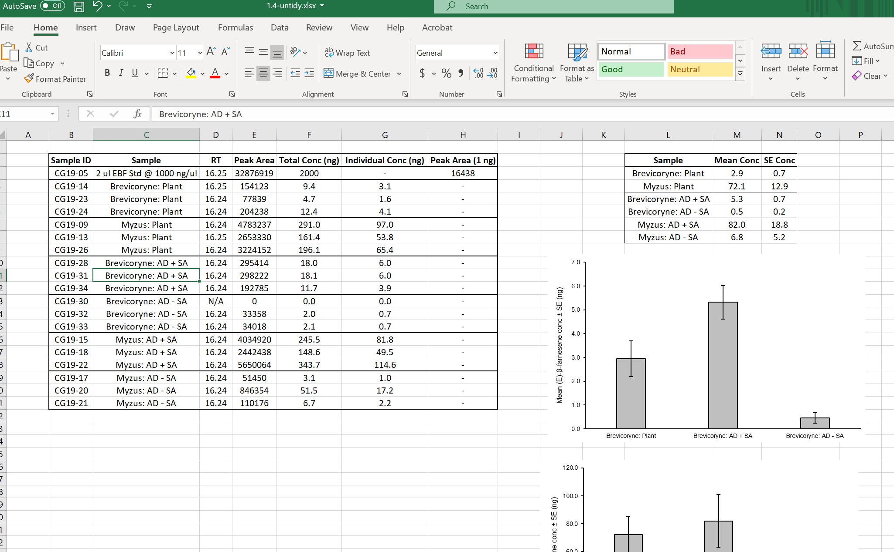
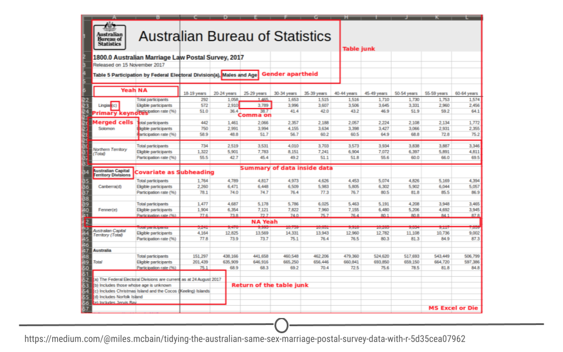
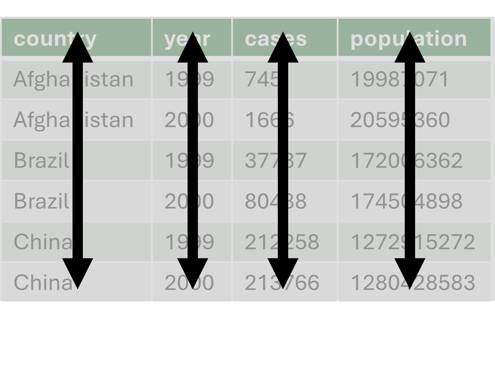
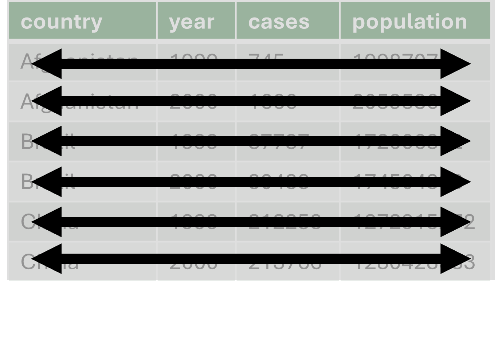
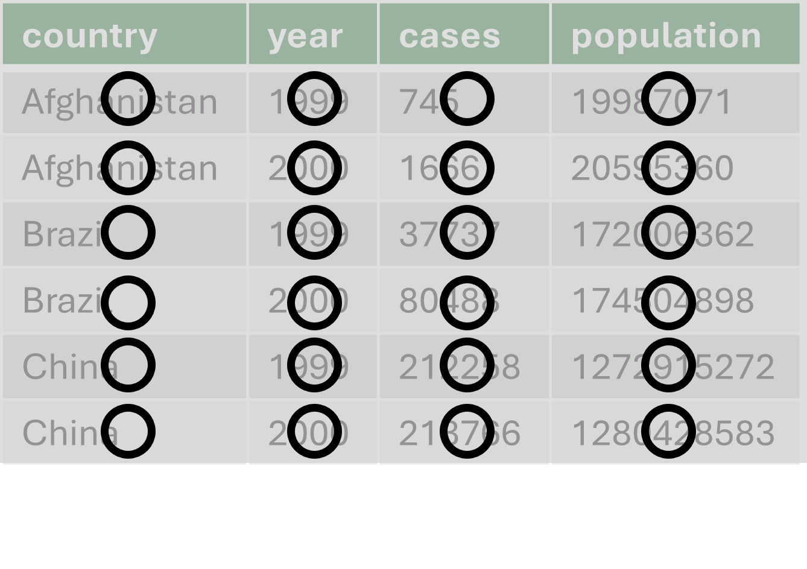
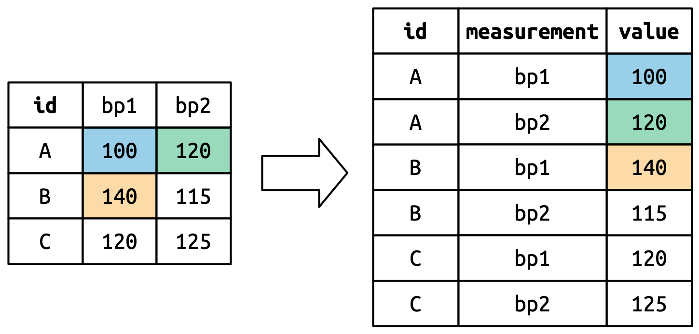
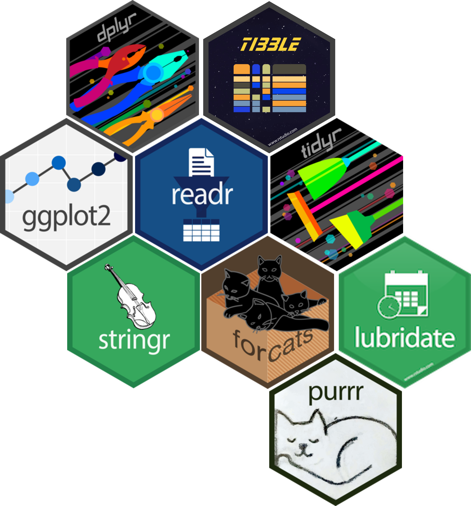

## Introduction to session

## The problem with data

-   Real world data often messy
-   Often not collected in tidy formats
-   Can slow down analysis and increase frustration

## Messy, untidy data

::: {.blockquote .left-quote .fragment}
"Happy families are all alike; every unhappy family is unhappy in its own way." - Leo Tolstoy
:::

<br>

::: {.blockquote .right-quote .fragment}
"Tidy datasets are all alike, but every messy dataset is messy in its own way." - Hadley Wickham
:::

<br> 

::: fragment
According to an [article](https://www.forbes.com/sites/gilpress/2016/03/23/data-preparation-most-time-consuming-least-enjoyable-data-science-task-survey-says/) in Forbes:
:::

::: {.blockquote .left-quote .fragment}
"Data preparation accounts for about 80% of the work of data scientists"
:::

## Common problems with messy data sets

::: incremental
-   Column headers are values but should be variable names
-   Single column with multiple variables
-   Variables entered in both rows and columns
-   Multiple types of observational units stored in the same table
-   A single observational unit is stored in multiple tables
:::

::: fragment
Examples from: [Hadley Wickham (2014)](https://www.jstatsoft.org/article/view/v059i10)
:::

## Other issues - Excel formatting...

-   Merged cells
-   Explanatory text (should be elsewhere)
-   Unnecessary table *decoration*
-   Summary stats/info

## What can untidy data look like?

{fig-align="center" height="90%"}

## What can untidy data look like?

{fig-align="center" height="50%"}

## Why we don't want messy data

-   Difficult to analyse
-   Easy to make mistakes
-   Not reproducible

## Messy data might not be perfect, but we can work with it...

<br>

::: fragment
But what does "tidy" data look like?
:::

## One *column*: One *variable*

{width="100%" fig-align="center"}

## One *row*: One *observation*

{width="100%" fig-align="center"}

## One *cell*: One *value*

{width="100%" fig-align="center"}

## Tidy data visual example

## Tidy data visual example


## Tidy data visual example


## Tidy data visual example



## Why we like 'tidy' data

-   Easier to wrangle, plot and model
-   Gives us a standard structure that works beautifully with the `tidyverse`

# The Central Idea

Most data analysis can be described as:

## Split -\> Apply -\> Combine

1.  **Split** data into subsets
2.  **Apply** a function to each subset
3.  **Combine** the results into a structured output

::: {.blockquote .left-quote .fragment}
Not a programming trick, but a conceptual framework.
:::

## Split

::: {.blockquote .left-quote .fragment}
Partitioning a dataset into meaningful components
:::


::: fragment
E.g., Split by:

-   category (e.g. variety, region)
-   time interval
-   logical condition
-   column dimension
-   row chunks
:::

::: {.blockquote .left-quote .fragment}
Splitting defines structure
:::

## Apply

::: {.blockquote .left-quote .fragment}
Performing an operation on each partition independently
:::


::: fragment
E.g., Applying functions like:

-   `mean()`, `median()`, `sd()`
-   scaling
-   thresholding
-   modelling
-   transformation
:::

::: {.blockquote .left-quote .fragment}
The same function is applied to each subset.
:::

## Combine

::: {.blockquote .left-quote .fragment}
Reassembling results into a structured object
:::


::: fragment
E.g.,:

-   Data frame
-   List
-   Vector
-   Array
:::

::: {.blockquote .left-quote .fragment}
The output dimension may differ from the input dimension.
:::

# Preparing a dataset for analysis

An R toolbox

## The Original `plyr` Design

`plyr` used naming conventions such as:

-   `ddply()` — data frame → data frame\
-   `dlply()` — data frame → list\
-   `llply()` — list → list

The letters represented:

**Input dimension → Output dimension**

The framework was dimension-agnostic.

## Dramatic entrance from the Tidyverse...

::::: columns
::: {.column width="50%"}
-   Collection of R packages for data science
-   Built around tidy data principles
-   Consistent syntax & philosophy
:::

::: {.column width="50%"}
{fig-align="center"}
:::
:::::

## What's in the Tidyverse?

:::::: {layout="[[30, -5, 30, -5, 30], [30, -5, 30, -5, 30]]" layout-valign="bottom"}


::: fig-label
Visualize your data
:::

::: fig-label
Manipulate your data
:::

::: fig-label
Tidy your data
:::
::::::

## What's in the Tidyverse?

:::::: {layout="[[30, -5, 30, -5, 30], [30, -5, 30, -5, 30]]" layout-valign="bottom"}


::: fig-label
Read rectangular data
:::

::: fig-label
Work with functions and vectors
:::

::: fig-label
Re-imagining the data frame
:::
::::::

## What's in the Tidyverse?

:::::: {layout="[[30, -5, 30, -5, 30], [30, -5, 30, -5, 30]]" layout-valign="bottom"}


::: fig-label
Work with strings
:::

::: fig-label
Work with factors
:::

::: fig-label
Work with dates and times
:::
::::::

## Today's focus

::::: {layout="[[45,-10,45],[45,-10,45]]"}
{fig-align="center"}

{fig-align="center"}

::: fig-label
Tidying
:::

::: fig-label
Wrangling
:::
:::::

## `dplyr` Origins

`dplyr` = **d** (data frames) + **plyr**

-   `plyr` was an earlier R package
-   Designed as a general tool for manipulating data
-   Name inspired by *pliers*: a tool for shaping objects


::: {.callout-note}
## The logic of `dplyr` 
Originates from the `split–apply–combine` strategy formalised in:

Wickham (2011), *The Split-Apply-Combine Strategy for Data Analysis*, Journal of Statistical Software.
:::

## Why `dplyr`?

-   Data manipulation in the tidyverse
-   Consistent, readable grammar
    -   First argument is always a data frame
    -   Other arguments describe which column to operate on
    -   Output always a new data frame
-   Works with tibbles and pipes
-   Split -> Apply -> Combine philosophy remains the same

## A couple quirks...

The tidyverse can have a couple weird but helpful features...

-   Tibbles
-   Pipes

## Tibbles

-   Special type of data frame used in the tidyverse
-   Designed for large datasets
    -   Only show the first few rows and columns that fit on one screen
    -   can use `View()` to see data in interactive, scrollable and filterable view
    -   or `glimpse()` to see all variables in console

## Pipes

::: {incremental}
-   Two forms:
    -   Native pipe `|>`
    -   `magrittr` package pipe `%>%`
        -   (*package loaded as part of tidyverse*)
-   Keyboard short cut
    -   `ctrl` + `shift` + `m`
    -   `cmd` + `shift` + `m`
    -   Need to change R settings to use native pipe with shortcut
:::

## Why pipes?

-   Takes whats on the left and passes it along to the function on it's right
-   Reduces need for nesting or use of intermediate objects
-   Native `|>` vs magrittr `%>%`
    -   generally behave identically
    -   `%>%` was introduced in 2014 in R
    -   `|>` included in R in 2021 but now part of base R

## Quick syntax with and without pipes

:::::::: columns
:::: {.column width="48%"}
No pipe

::: incremental
-   `function(data, arguments)`
-   Data is first argument
-   Function **wraps around** data
:::
::::

::: {.column width="4%"}
:::

:::: {.column width="48%"}
With Pipe

::: incremental
-   `data |> verb(arguments)`
-   Data **flows into** function
-   Easier to read and chain multiple steps
:::
::::
::::::::

## Core `dplyr` verbs

-   Each verb does one thing
-   Solving complex problems require combining multiple verbs with pipes
-   Organised into four groups based on what they operate on:
    -   rows
    -   columns
    -   groups
    -   tables

## Core `dplyr` verbs


| Verb        | Role in Split–Apply–Combine          |
|-------------|--------------------------------------|
| filter()    | Reduce rows before split             |
| select()    | Reduce columns                       |
| mutate()    | Apply function while preserving rows |
| summarise() | Apply function and reduce rows       |
| group_by()  | Define the split                     |
| arrange()   | Reorder after combine                |

## Row verbs

These verbs work across or modify **rows** of your dataset:

::: incremental
-   `filter()` – keep only rows that match a condition\
-   `arrange()` – reorder rows\
-   `distinct()` – keep only unique rows
:::

## Filtering

dplyr

::: fragment
``` r
# Filter to include only humans
starwars |> 
  filter(species == "Human")
```
:::

Base R

::: fragment
``` r
# Filter using indexing
starwars[starwars$species == "Human", ]
```
:::

## Arranging

dplyr

::: fragment
``` r
# Arrange by height in ascending order
starwars |> 
  arrange(height)
```
:::

Base R

::: fragment
``` r
# Use order() to sort by height
starwars[order(starwars$height), ]
```
:::

## Distinct

dplyr

::: fragment
``` r
# Get unique species values in a data frame
starwars |> 
  distinct(species)
```
:::

Base R

::: fragment
``` r
# To get a data frame equivalent to dplyr
data.frame(species = unique(starwars$species))
```
:::

## Column verbs

These verbs help you work with **columns** of data:

::: incremental
-   `mutate()` – create or transform columns\
-   `select()` – keep/drop columns\
-   `rename()` – rename columns\
-   `relocate()` – reorder columns
:::

## Mutate

dplyr

::: fragment
``` r
# Create a new column with height in meters
starwars |> 
  mutate(height_m = height / 100)
```
:::

Base R 

::: {.fragment}

``` r
# Same result using base R column creation
starwars$height_m <- starwars$height / 100
```

:::

## Select

dplyr

::: fragment
``` r
# Select specific columns
starwars |> 
  select(name, species, height)
```
:::

Base R

::: fragment
``` r
# Use column indexing
starwars[c("name", "species", "height")]
```
:::

## Rename

dplyr

::: fragment
``` r
# Rename the 'name' column
starwars |> 
  rename(character_name = name)
```
:::

Base R

::: fragment
``` r
# Rename column manually
names(starwars)[names(starwars) == "name"] <- "character_name"
```
:::

## Relocate

dplyr

::: fragment
``` r
# Move 'species' before 'name'
starwars |> 
  relocate(species, .before = name)
```
:::

Base R

::: fragment
``` r
# Reorder columns manually
cols <- names(starwars)
new_order <- c("species", setdiff(cols, "species"))
starwars[new_order]
```
:::

## Group verbs

These verbs are for **grouped operations**, often used in summarising:

::: incremental
-   `group_by()` – group dataset by one or more variables\
-   `summarise()` – calculate summary statistics per group\
-   `slice_*()` – select specific rows within groups (e.g., `slice_max()`, `slice_head()`)
:::

## Group by & Summarise

dplyr

::: fragment
``` r
# Group by species and calculate average height
starwars |> 
  group_by(species) |> 
  summarise(mean_height = mean(height, na.rm = TRUE))
```
:::

Base R

::: fragment
``` r
# Use aggregate to get same result
aggregate(height ~ species, data = starwars, FUN = mean, na.rm = TRUE)
```
:::

## Slice

dplyr

::: fragment
``` r
# Take first 3 rows
starwars |> 
  slice(1:3)
```
:::

Base R

::: fragment
``` r
# Base R equivalent
starwars[1:3, ]
```
:::

## Dimensional structures

::: {.block-quote .left-quote .fragment}
Understanding how `dplyr` verbs affect dimensional structure is fundamental.
:::

::: fragment

-   `mutate()` preserves row count\
-   `summarise()` reduces row count\
-   `filter()` reduces row count\
-   `pivot_longer()` increases row count\
-   `pivot_wider()` may reduce row count
:::

::: {.block-quote .left-quote .fragment}
Every transformation changes dimensional structure.
:::

## A Data Transformation Recipe

A recipe is:

::: {.block-quote .left-quote .fragment}
A reproducible sequence of split–apply–combine operations that converts raw data into structured analytical output.
:::

<br>

::: fragment
Structure:
:::

::: {.block-quote .left-quote .fragment}
Raw → Clean → Partition → Apply → Combine → Visualise
:::

## The dplyr Pipe and Recipe Flow

A **dplyr recipe** is a *step-by-step transformation* of data

::: fragment
-   Each stage passes its result to the next
-   The key ingredient for recipe flow is the **pipe** operator (`%>%` or `|>`) which reads as "and then."
:::

::: fragment
Allows you to express a sequence of operations that mimic your analytic reasoning:
:::

::: {.block-quote .left-quote .fragment}
Take raw data, **and then** filter, **and then** group, **and then** summarise, **and then** reshape.
:::

## Anatomy of a `dplyr` Recipe

A typical dplyr transformation has this sequential structure:

``` r
data %>%
  filter(...) %>%         # Step 1: Remove unwanted rows
  mutate(...) %>%         # Step 2: Add or modify columns
  group_by(...) %>%       # Step 3: Define partitions
  summarise(...) %>%      # Step 4: Aggregate within partitions
  arrange(...)            # Step 5: Order the results (optional)
```
::: fragment
-   Each line is a **verb**, describing what to do at that step.
-   The output of one operation becomes the input of the next.
-   This sequential flow matches the way you *think* about transforming data.
:::

## Anatomy of a `dplyr` recipe
Pipelines improve **readability** and **reproducibility**

-   Makes analysis transparent
-   Trace the journey from messy input to structured output

## Piping it all together...

dplyr

::: fragment
``` r
starwars |> 
  filter(!is.na(mass)) |>         # Remove rows where mass is NA
  group_by(species) |>            # Group data by species
  summarise(avg_mass = mean(mass)) |>  # Mean mass for each species
  arrange(desc(avg_mass))         # Sort results by mean mass, descending
```
:::

Base R

::: fragment
``` r
# Filter out NAs
filtered <- starwars[!is.na(starwars$mass), ]

# Mmean mass by species
avg_mass <- aggregate(mass ~ species, data = filtered, FUN = mean)

# Sort descending
avg_mass <- avg_mass[order(-avg_mass$mass), ]
```
:::

## The `tidyr` package

::::: columns
::: {.column width="65%"}
-   Help tidy messy data
-   Focus on reshaping and reorganizing
-   Built around tidy data principles
:::

::: {.column width="35%"}
{fig-align="center"}
:::
:::::

## `tidyr` functions

::: incremental
-   `pivot_longer()`: Reshapes wide data into long format
-   `pivot_wider()`: Turns long data into wide format
-   `separate()`: Splits one column into multiple based on a delimiter
-   `unite()`: Combines multiple columns into one
-   `drop_na()` / `replace_na()`: Remove or fill in missing values in a tidy-friendly way
:::

## pivot_longer()

tidyr

::: fragment
``` r
# Pivot week columns into long format
billboard_long <- billboard_sm |>
  pivot_longer(
    cols = starts_with("wk"),
    names_to = "week",
    values_to = "rank"
  )
```
:::

Base R

::: fragment
``` r
# Reshape wide week columns to long
billboard_long_base <- reshape(
  billboard_sm,
  varying = grep("^wk", names(billboard_sm), value = TRUE),
  v.names = "rank",
  timevar = "week",
  times = grep("^wk", names(billboard_sm), value = TRUE),
  direction = "long"
)
```
:::

## separate()

tidyr

::: fragment
``` r
# Split date.entered into components
billboard_sep_date <- billboard_long |>
  separate(date.entered, into = c("year", "month", "day"), sep = "-")
```
:::

Base R

::: fragment
``` r
# Use strsplit to separate date into components
date_parts <- do.call(rbind, strsplit(as.character(billboard_long_base$date.entered), "-"))
billboard_long_base$year <- date_parts[, 1]
billboard_long_base$month <- date_parts[, 2]
billboard_long_base$day <- date_parts[, 3]
```
:::

## `dplyr` & `tidyr`: The Big Picture

-   Built for readable, transparent and reproducible data transformations
-   Expresses workflows with a consistent "verb-based" grammar
-   Easy to debug
-   Abstracts away implementation details so you can focus on *what* to do, not *how* to do it
-   Powers modern, scalable workflows in R—but the conceptual grammar transfers beyond R

# Lab

## Rotation Lab Overview

Split into 3 groups and rotate across three problems.

Each problem emphasises a different form of splitting:

1.  Explicit grouping
2.  Dimensional reshaping
3.  Conditional partitioning

All datasets are built into `ggplot2`.

## Required packages

``` r
library(dplyr)
library(tidyr)
library(ggplot2)

data("diamonds", package = "ggplot2")
data("economics", package = "ggplot2")
data("midwest", package = "ggplot2")
```

# Problem A

## Explicit Group-Based Split

Dataset: `diamonds`

Conceptual focus:

Split by category → Apply summary → Combine → Visualise

## Task A {.smaller}

1.  Introduce artificial missing values in `price` and `carat`
2.  Remove missing values
3.  Cap `price` at 15000 using a threshold
4.  Split by `cut`
5.  Compute:
    -   mean capped price
    -   median capped price
    -   mean carat
    -   count
6.  Pipe results into a bar plot

## Task A solution

``` r
# Solution for Task A
set.seed(123)  # For reproducibility

diamonds_miss <- diamonds |>
  mutate(
    price = ifelse(runif(n()) < 0.05, NA, price),  # 5% missing in price
    carat = ifelse(runif(n()) < 0.05, NA, carat)   # 5% missing in carat
  ) |>
  filter(!is.na(price), !is.na(carat)) |>
  mutate(price_capped = pmin(price, 15000)) |>
  group_by(cut) |>
  summarise(
    mean_capped_price = mean(price_capped),
    median_capped_price = median(price_capped),
    mean_carat = mean(carat),
    count = n(),
    .groups = "drop"
  ) |>
  ggplot(aes(x = cut, y = mean_capped_price, fill = cut)) +
  geom_col(show.legend = FALSE) +
  labs(
    title = "Mean capped price by cut",
    x = "Cut",
    y = "Mean capped price"
  )
```

## Conceptual Questions

-   What variable defines the split?
-   Does `mutate()` change row count?
-   Does `summarise()` change row count?
-   What is the dimension of the combined result?

# Problem B

## Dimensional Split via Reshaping

Dataset: `economics`

Conceptual focus:

Split by time interval and variable dimension.

## Task B

1.  Create year and quarter variables from `date`
2.  Group by year and quarter and calculate mean of each variable:
    -   unemploy
    -   uempmed
    -   psavert
3.  Plot the quarterly average of unemployment

## Problem B Solution

``` r
library(dplyr)
library(ggplot2)
library(lubridate)

# Add year and quarter columns
economics_q <- economics %>%
  mutate(
    year = year(date),
    quarter = quarter(date)
  )

# Group by year and quarter, then summarise quarterly means
economics_quarterly <- economics_q %>%
  group_by(year, quarter) %>%
  summarise(
    mean_unemploy = mean(unemploy, na.rm = TRUE),
    mean_uempmed = mean(uempmed, na.rm = TRUE),
    mean_psavert = mean(psavert, na.rm = TRUE),
    .groups = "drop"
  )

# Simple line plot: quarterly unemployment
ggplot(economics_quarterly, aes(x = year + (quarter - 1)/4, y = mean_unemploy)) +
  geom_line(color = "steelblue", size = 1) +
  labs(
    title = "Quarterly Mean Unemployment",
    x = "Year (Quarter)",
    y = "Mean Unemployment"
  )
```

## Conceptual Questions

-   Which variables define the time-based split in Task B?
-   How does creating year and quarter columns affect the structure of the data?
-   Why do we use `group_by(year, quarter)` before summarising?
-   What does summarising multiple variables together achieve in this context?
-   How does this example illustrate split–apply–combine over time?

# Problem C

## Conditional Partitioning

Dataset: `midwest`

Conceptual focus:

Splitting via logical classification.

## Task C

Goal: Compare average population density by poverty status, across states.

1.  Create a simple poverty band: "Low" if poverty \< 15%, otherwise "High"
2.  Group by state and poverty band
3.  Compute average population density for each group

## Problem C Solution

``` r
library(dplyr)
library(ggplot2)

# Add a poverty band with mutate, then group and summarise
midwest_summary <- midwest %>%
  mutate(
    poverty_band = ifelse(poverty < 15, "Low", "High")
  ) %>%
  group_by(state, poverty_band) %>%
  summarise(
    mean_density = mean(poptotal / area, na.rm = TRUE)
  )

# Visualise
ggplot(midwest_summary, aes(x = poverty_band, y = mean_density, fill = poverty_band)) +
  geom_col() +
  facet_wrap(~state) +
  labs(
    title = "Mean Population Density by Poverty Band and State",
    x = "Poverty Band",
    y = "Mean Population Density"
  ) +
  theme_minimal() +
  theme(legend.position = "none")
```

## Conceptual Questions

-   What does `mutate()` add to your data here?
-   What variable(s) define the data split for the summary?
-   Why do we use `group_by()` before `summarise()`?

## Further exploration

Let's explore a more advanced transformation using `filter`, grouped summaries, and visualisation.

Goal: For each state and poverty band, calculate:

-   **mean** of population density
-   **standard deviation** of population density
-   **for counties with population over 10,000**
-   visualise the results with error bars.

## Further exploration

``` r
library(dplyr)
library(ggplot2)

midwest_stats <- midwest %>%
  filter(poptotal > 10000) %>%
  mutate(
    poverty_band = ifelse(poverty < 15, "Low", "High"),
    pop_density = poptotal / area
  ) %>%
  group_by(state, poverty_band) %>%
  summarise(
    mean_density = mean(pop_density, na.rm = TRUE),
    sd_density = sd(pop_density, na.rm = TRUE),
    .groups = "drop"
  )

```

## Further exploration

``` r
# Visualise mean ± SD with pointrange
ggplot(midwest_stats, aes(x = poverty_band, y = mean_density, ymin = mean_density - sd_density, ymax = mean_density + sd_density, color = poverty_band)) +
  geom_pointrange(position = position_dodge(width = 0.5)) +
  facet_wrap(~state) +
  labs(
    title = "Population Density (Mean ± SD) by Poverty Band and State (Counties > 10,000 pop.)",
    x = "Poverty Band",
    y = "Population Density"
  ) +
  theme_minimal() +
  theme(legend.position = "none")
```

## Reflection

Consider:

-   What defines a partition?
-   What determines output dimensionality?
-   Why does operation order matter?
-   How does `dplyr` encode split–apply–combine?

## Key Takeaways

-   `dplyr` & `tidyr` use `tidyverse` grammar for structured data manipulation
-   Dimensional changes are deliberate and traceable
- Pipes: build readable, step-by-step workflows
- Small, simple verbs — like filter(), mutate(), group_by() — combine to solve complex problems
-   Split–apply–combine is the unifying principle

## Additional Resources

-   [Hadley Wickham (2014)](https://www.jstatsoft.org/article/view/v059i10)
-   [R for Data Science (2e)](https://r4ds.hadley.nz/)
-   [Tidyverse documentation](https://www.tidyverse.org/)
-   [R Studio cheat sheets](https://posit.co/resources/cheatsheets/)
-   [Tidy Tuesday Project](https://github.com/rfordatascience/tidytuesday)